# Complete diffusion-MRF optimization example

## 1. Objective

This full run tests a sequential worked example: educated initialization, flip-angle optimization, phase-family selection/refinement, and identical phantom acquisition/recovery. This is not the previous joint-optimization run. Smoke results are orchestration checks only; full results are the practical scientific example.

Execution evidence: {"passed": 178, "failures": 0, "skipped_or_expected_failures": 9, "source": "C:\\Users\\visna\\Documents\\Codex\\2026-09-09\\are\\work\\MRF_diffusion_optimization\\data\\output\\complete_worked_example\\test_suite.xml"}. Backend: cpu; computation before reporting: 499.71 seconds. Source snapshot, configuration, versions and raw numerical arrays accompany this report.

## 2. Starting sequence

The thesis used a truncated Sommer train (section 5.2.2), whose input array is missing. Here the target is 0.25 + 0.15 sin²(pi*n/(N-1)) radians, N=40, fitted by the existing cubic initializer. It starts at zero RF phase. This smooth bounded arch is an educated example, not a fabricated historical three-arch train. Actual decoded arrays and target/projection are saved.

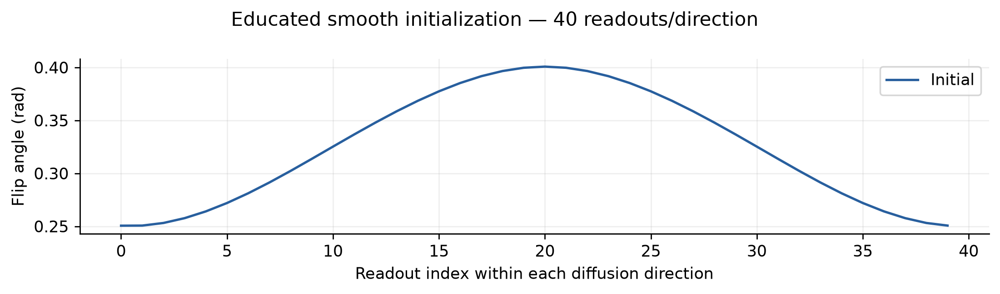

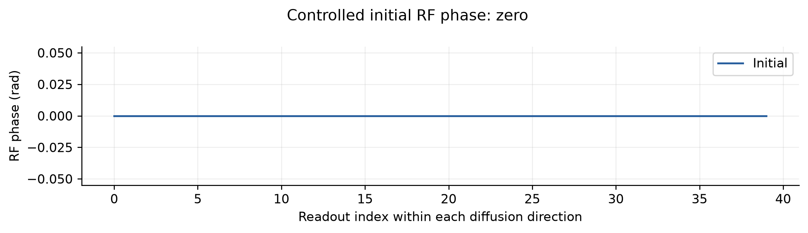

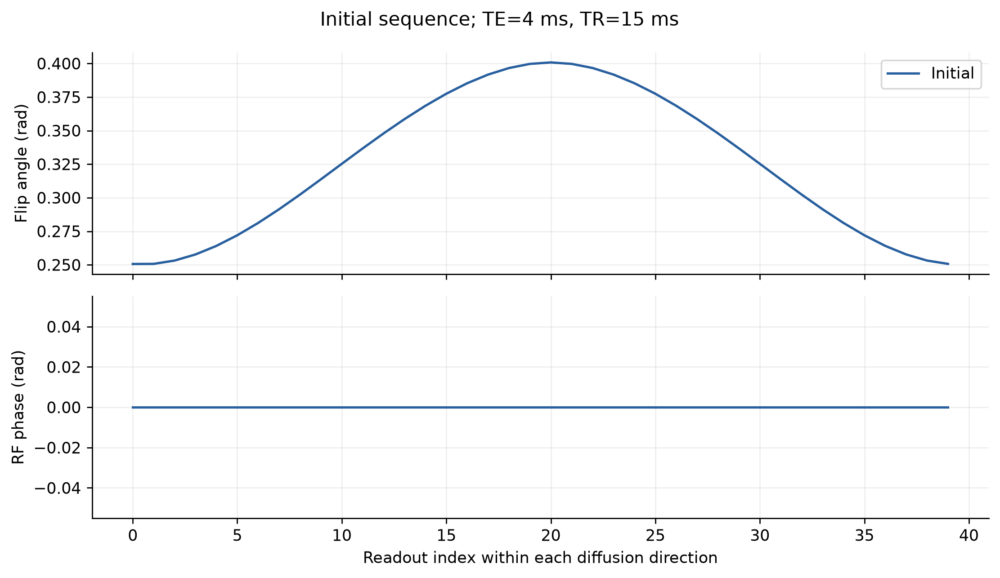

## 3. Initial theoretical performance

Baseline evaluation occurred before SLSQP. Each stage saves raw J/F/covariance/CRLB. Conditional objective bounds are tissue-weighted relative SD for T1,T2,internal M. Separate fixed-orientation finite-difference diagnostics use T1,T2,external density,MD,FA,object phase at each tissue. The diagnostic plot/summary uses tissue 0. These estimands and normalizations must not be conflated.

## 4. Flip-angle optimization

SLSQP optimized 7 angle coefficients with zero phase. Constraints: pi/18 to pi/3 radians, adjacent step <=0.02 rad, coefficients within +/-1000. Unchanged weighted L1 relative-SD objective, equal tissue weights, default ftol=1e-6. Status: Optimization terminated successfully; 9 iterations, 10 evaluations, 96.32 s including compilation. Minimum constraint residual -9.06e-12. Nonconverged smoke iterates are retained and explicitly labeled.

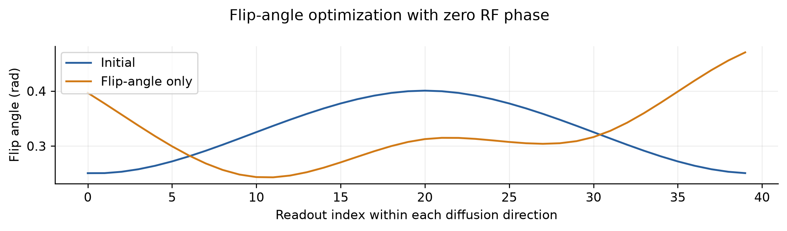

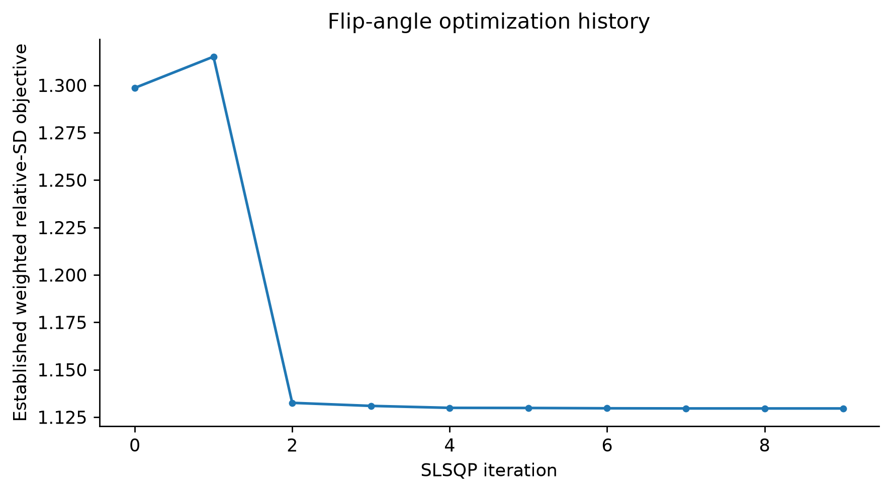

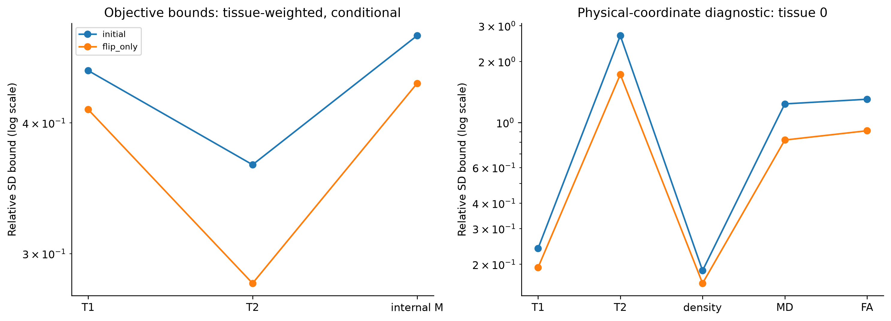

## 5. Phase-modulation strategies

Tested zero phase, cumulative piecewise quadratic, cumulative piecewise linear, sinusoidal and alternating generators. Their historical degree amplitudes are converted to radians and projected into the same cubic phase spline. Generated and applied arrays/projection errors are saved. Generator quadratic is different from the double-integrated spline decoder. The discontinuous malleable decoder and unrestricted free-form optimization were not used as extra generator families.

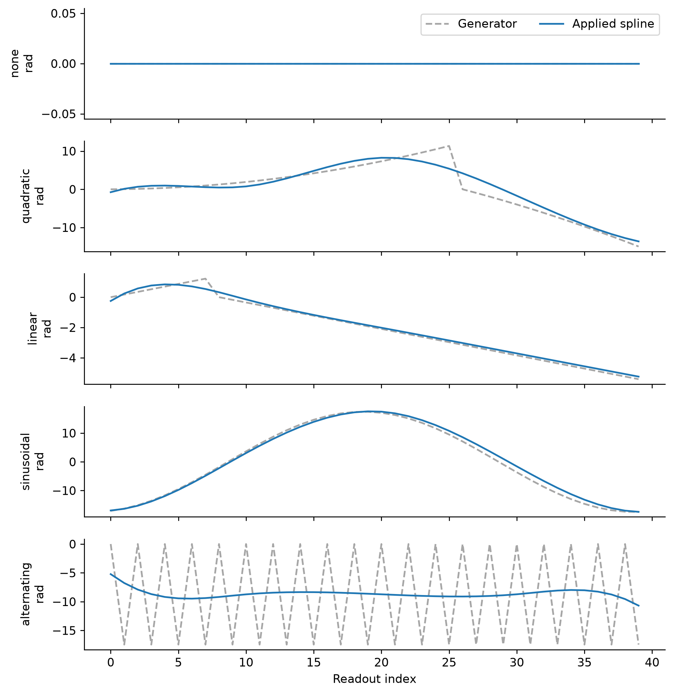

## 6. Phase-method comparison

Before phantom simulation, selection_rule.json fixes minimum established objective as the criterion. All angle coefficients, tissues, timing and directions remain fixed. 33 fractions span the configured interval for each nonzero family. No image-domain outcome is used in selection. Exact ties retain the first configured candidate. The table includes diagnostic bounds but these do not select the winner.

| Stage | Objective | conditional T1 | conditional T2 | internal M | diagnostic MD | diagnostic FA |
| --- | --- | --- | --- | --- | --- | --- |
| initial | 1.29862 | 0.448955 | 0.364881 | 0.484781 | 1.23641 | 1.30352 |
| flip_only | 1.12961 | 0.412148 | 0.281042 | 0.436416 | 0.820358 | 0.911571 |
| candidate_none | 1.12961 | 0.412148 | 0.281042 | 0.436416 | 0.820358 | 0.911571 |
| candidate_quadratic | 1.08902 | 0.401364 | 0.263301 | 0.424357 | 0.842945 | 0.922246 |
| candidate_linear | 1.12014 | 0.411892 | 0.272086 | 0.436164 | 0.828013 | 0.915434 |
| candidate_sinusoidal | 1.05867 | 0.396132 | 0.246517 | 0.41602 | 0.928729 | 0.989073 |
| candidate_alternating | 1.10139 | 0.413953 | 0.250143 | 0.437294 | 0.829106 | 0.907097 |
| final | 1.05839 | 0.396688 | 0.245012 | 0.416687 | 0.921493 | 0.982596 |

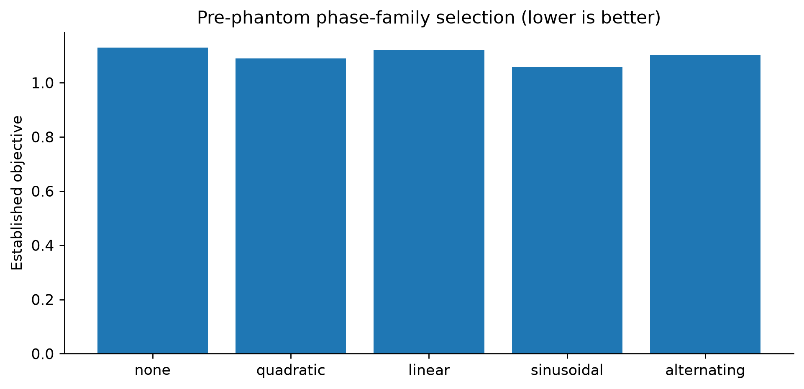

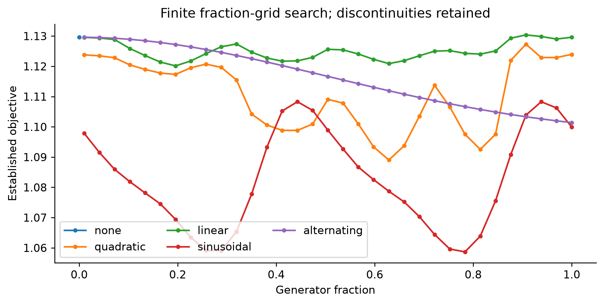

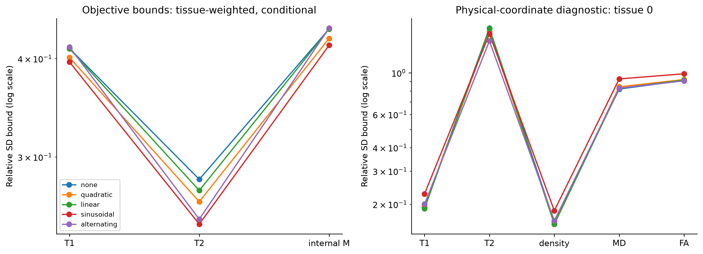

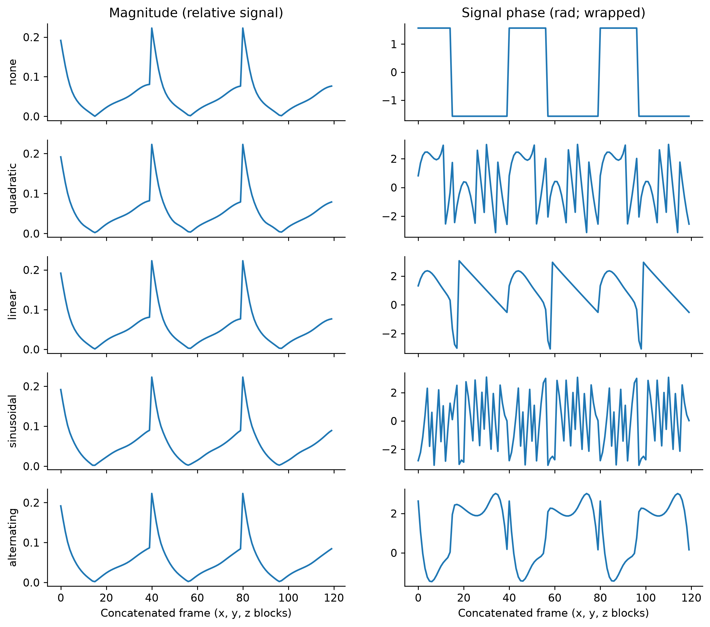

## 7. Selected phase method

Selected sinusoidal at fraction 0.7834375, objective 1.05866916. The selected family was refined locally using the configured denser grid including the original winning fraction. Final fraction 0.77376953; objective 1.05838662. Selection and refinement were completed before phantom generation. This is a bounded search result, not proof of the globally best phase method.

## 8. Final optimized sequence

Flip angles equal the flip-only optimum exactly. Final RF phase is the selected historical family's refined spline projection. The workflow is sequential flip-angle SLSQP followed by phase-family fraction search; no unreported joint optimization or post-simulation RF phase rotation is applied.

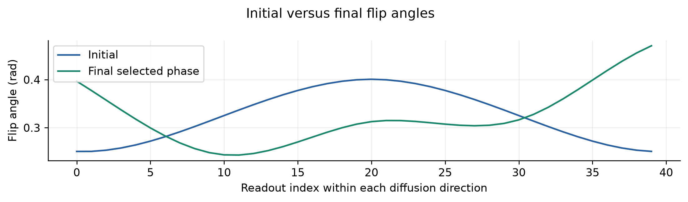

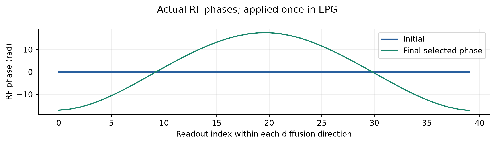

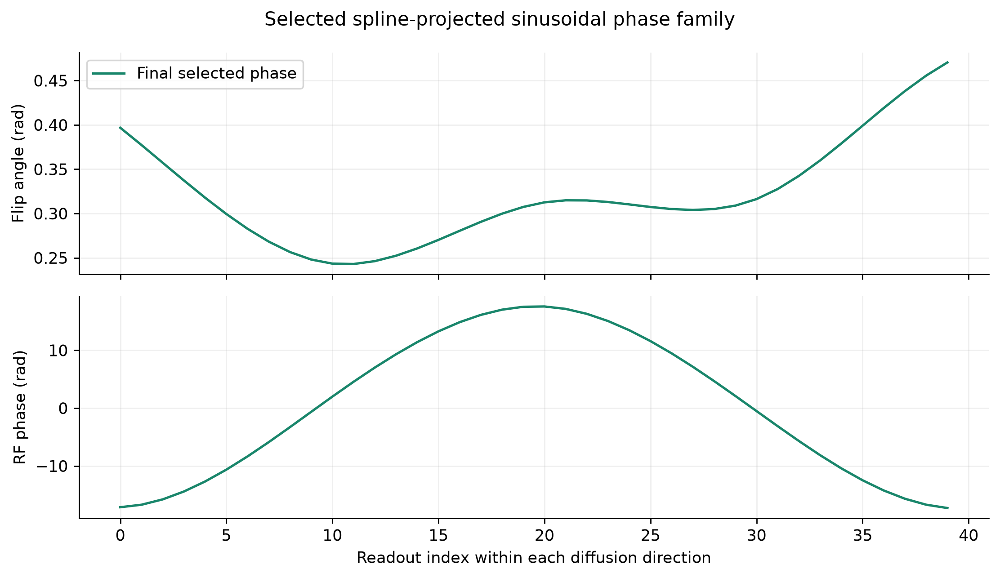

## 9. Theoretical improvement

Established objective changes 1.2986159 -> 1.12960518 -> 1.05838662, a 18.50% reduction from initialization. This objective omits diffusion uncertainty (I02). Separate MD/FA diagnostics differentiate the valid tensor parameterization and verify step-halving; they do not correct the diffusion signal model. Local bounds do not predict nonlinear aliasing/matching bias.

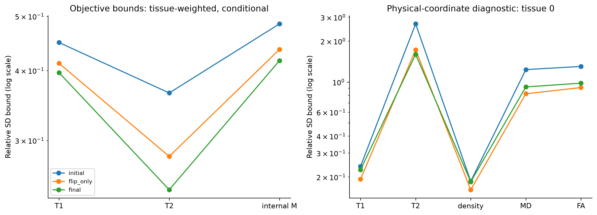

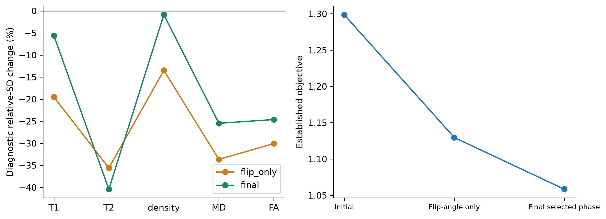

## 10. Signal behaviour

All curves use the actual RF trains and the same two tissue/tensor configurations. Signal phase is shown wrapped; direction blocks are concatenated, independently initialized, not presented as a continuous acquisition clock. Doubled-state checks on two dictionary endpoints per sequence are saved separately. Complex temporal phase is preserved throughout.

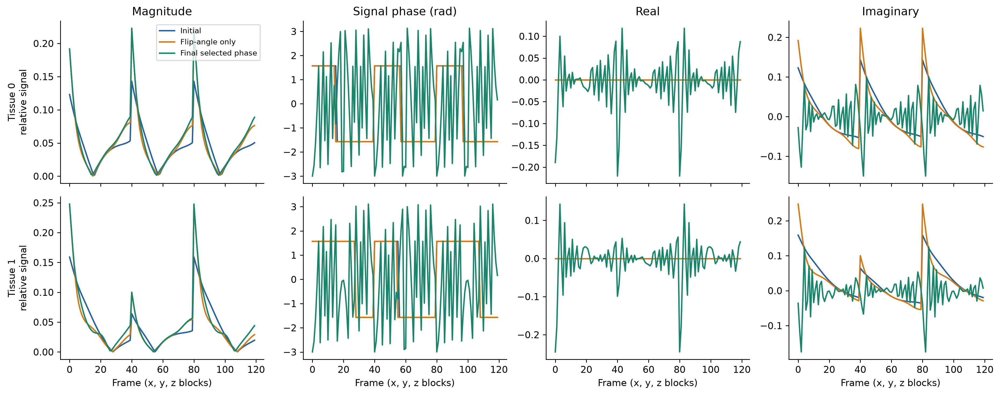

## 11. Phantom

[16, 16] checkerboard, two compartments: T1 750/1250 ms, T2 70/90 ms, density 1/0.9, MD 0.0007/0.001 mm²/s, FA 0.2/0.7, principal axes x/y. The prolate family has a=FA/sqrt(3-2FA²), eigenvalues MD*(1+2a), MD*(1-a), MD*(1-a). Tensor invariants reproduce requested values. Object phase is a separate fixed quadratic spatial field. Identical tissue signals are simulated once per unique tuple.

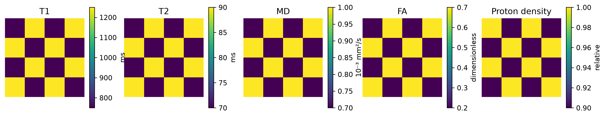

## 12. Reference reconstruction

All three sequences pass dictionary self-matching, direct phantom matching and noiseless Cartesian forward/adjoint/matching before spiral acquisition. The unchanged complex-image relative tolerance is 1e-4; discrete T1/T2/MD/FA reference recovery must be exact to roundoff. This is on-grid consistency, not general tissue-estimation validation.

| Sequence | Passed | Image relative error | Minimum dictionary margin |
| --- | --- | --- | --- |
| initial | True | 1.21978e-05 | 0.000560728 |
| flip_only | True | 1.21983e-05 | 0.000555475 |
| final | True | 1.21983e-05 | 0.000416289 |

## 13. Undersampling

Generated variable-density spiral with golden-angle schedule, interleaves [1, 4, 16]. Coordinates are (ky,kx) cycles/pixel, converted by the validated SigPy operator. Forward samples are unweighted. Reconstruction uses radial-increment DCF and operator-only central impulse gain, not phantom truth scaling. No scanner gradient/readout-time certification is implied. Noise levels [0.0, 0.001] are absolute Gaussian SD per real/imaginary k-space channel, seed 2026. Noiseless conditions run first. Paired-noise checks and measured signal-RMS/noise-RMS ratios are saved; fixed noise does not mean identical SNR for different signals.

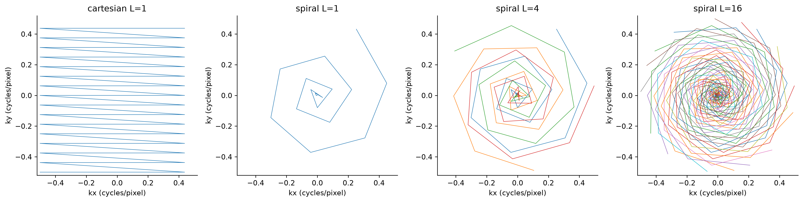

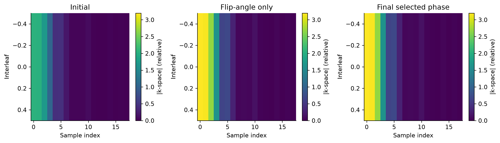

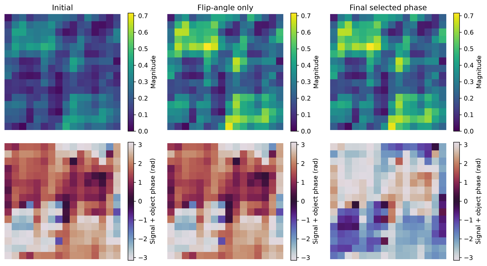

## 14. Quantitative reconstruction

Dictionary axes are independent T1 x T2 x MD x FA x orientation: 2^5=32 atoms, identical grid for all sequences. The saved budget guards memory before generation. Density and constant object phase are analytic complex least-squares estimates, with one scalar over the entire fingerprint. Maps derive from the selected valid tensor. All noiseless sampling levels appear below with identical parameter and signed-error scales across sequences and conditions. MD figure units are 10^-3 mm²/s; CSV units remain mm²/s.

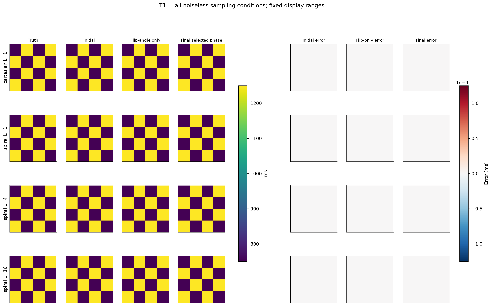

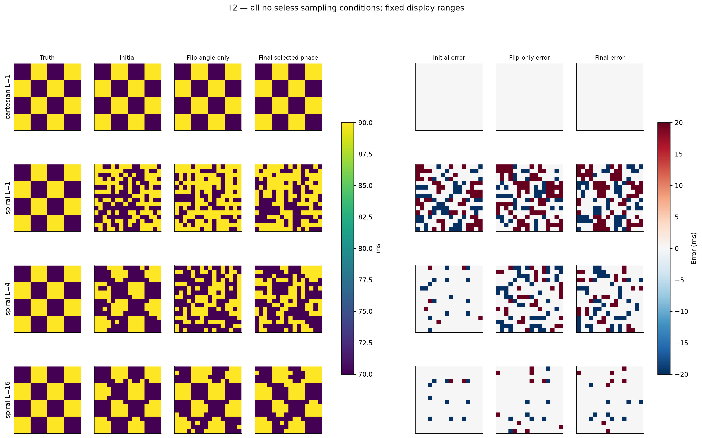

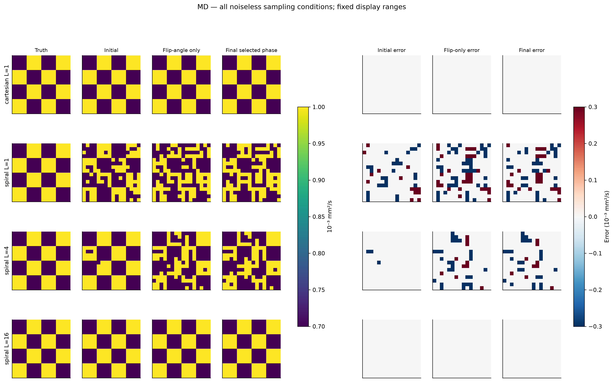

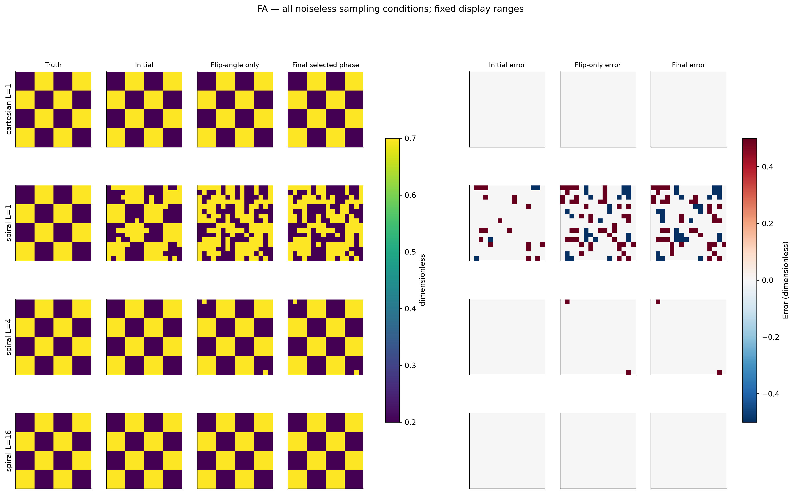

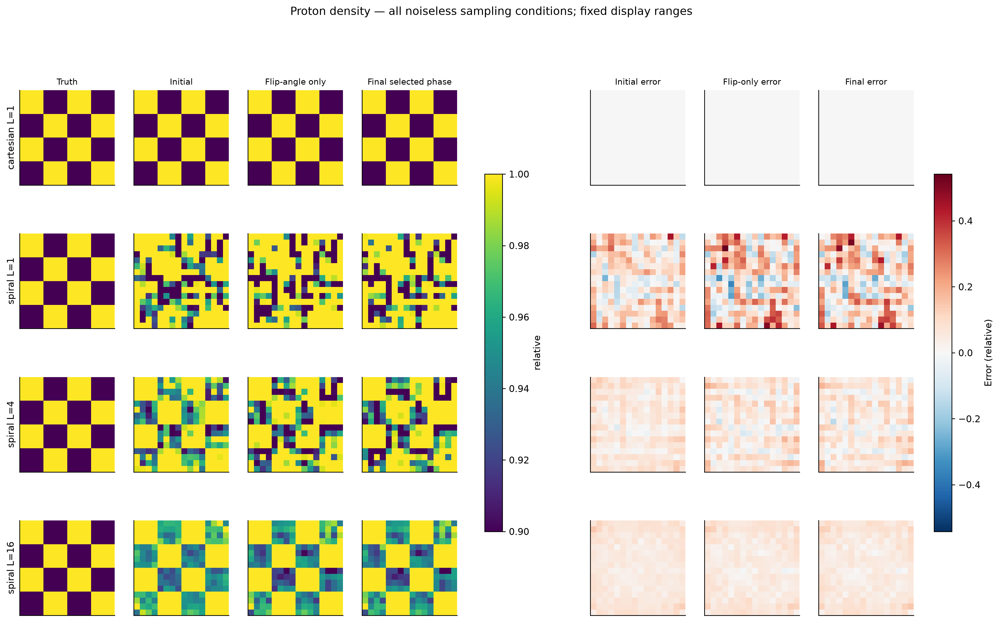

## 15. Initial versus optimized sequence

Global RMSE in native units is listed below. The master reconstruction_metrics.csv also includes MAE, RMSE, NRMSE=RMSE/RMS(truth), bias, valid/invalid voxel counts and compartment-level metrics for every sequence, sampling and noise condition.

| Sampling | Noise SD | Parameter | Initial RMSE | Flip-only RMSE | Final RMSE |
| --- | --- | --- | --- | --- | --- |
| cartesian_L1_noise0 | 0 | t1_ms | 0 | 0 | 0 |
| cartesian_L1_noise0 | 0 | t2_ms | 0 | 0 | 0 |
| cartesian_L1_noise0 | 0 | md_mm2_per_s | 0 | 0 | 0 |
| cartesian_L1_noise0 | 0 | fa | 0 | 0 | 0 |
| cartesian_L1_noise0 | 0 | proton_density | 1.16042e-05 | 1.16042e-05 | 1.16042e-05 |
| spiral_L1_noise0 | 0 | t1_ms | 0 | 0 | 0 |
| spiral_L1_noise0 | 0 | t2_ms | 13.5785 | 13.9754 | 14.1421 |
| spiral_L1_noise0 | 0 | md_mm2_per_s | 0.000120059 | 0.000161294 | 0.000145237 |
| spiral_L1_noise0 | 0 | fa | 0.146575 | 0.263317 | 0.259582 |
| spiral_L1_noise0 | 0 | proton_density | 0.131144 | 0.186757 | 0.18112 |
| spiral_L4_noise0 | 0 | t1_ms | 0 | 0 | 0 |
| spiral_L4_noise0 | 0 | t2_ms | 5.72822 | 11.6592 | 10.8253 |
| spiral_L4_noise0 | 0 | md_mm2_per_s | 3.2476e-05 | 0.000117094 | 0.000110926 |
| spiral_L4_noise0 | 0 | fa | 0 | 0.0441942 | 0.0441942 |
| spiral_L4_noise0 | 0 | proton_density | 0.0692679 | 0.0795421 | 0.0773878 |
| spiral_L16_noise0 | 0 | t1_ms | 0 | 0 | 0 |
| spiral_L16_noise0 | 0 | t2_ms | 4.33013 | 5.44862 | 5.15388 |
| spiral_L16_noise0 | 0 | md_mm2_per_s | 0 | 0 | 0 |
| spiral_L16_noise0 | 0 | fa | 0 | 0 | 0 |
| spiral_L16_noise0 | 0 | proton_density | 0.062024 | 0.0605157 | 0.0603133 |
| cartesian_L1_noise0.001 | 0.001 | t1_ms | 0 | 0 | 0 |
| cartesian_L1_noise0.001 | 0.001 | t2_ms | 0 | 0 | 0 |
| cartesian_L1_noise0.001 | 0.001 | md_mm2_per_s | 0 | 0 | 0 |
| cartesian_L1_noise0.001 | 0.001 | fa | 0 | 0 | 0 |
| cartesian_L1_noise0.001 | 0.001 | proton_density | 0.00166092 | 0.00141933 | 0.00127029 |
| spiral_L1_noise0.001 | 0.001 | t1_ms | 0 | 0 | 0 |
| spiral_L1_noise0.001 | 0.001 | t2_ms | 13.2877 | 14.0312 | 14.2522 |
| spiral_L1_noise0.001 | 0.001 | md_mm2_per_s | 0.000120059 | 0.00015799 | 0.00015 |
| spiral_L1_noise0.001 | 0.001 | fa | 0.14987 | 0.263317 | 0.255792 |
| spiral_L1_noise0.001 | 0.001 | proton_density | 0.1308 | 0.188167 | 0.182307 |
| spiral_L4_noise0.001 | 0.001 | t1_ms | 0 | 0 | 0 |
| spiral_L4_noise0.001 | 0.001 | t2_ms | 5.44862 | 11.726 | 10.68 |
| spiral_L4_noise0.001 | 0.001 | md_mm2_per_s | 2.65165e-05 | 0.000124373 | 0.000107711 |
| spiral_L4_noise0.001 | 0.001 | fa | 0 | 0.0441942 | 0.0441942 |
| spiral_L4_noise0.001 | 0.001 | proton_density | 0.0691861 | 0.0789316 | 0.0773206 |
| spiral_L16_noise0.001 | 0.001 | t1_ms | 0 | 0 | 0 |
| spiral_L16_noise0.001 | 0.001 | t2_ms | 4.50694 | 5.3033 | 5.44862 |
| spiral_L16_noise0.001 | 0.001 | md_mm2_per_s | 0 | 0 | 0 |
| spiral_L16_noise0.001 | 0.001 | fa | 0 | 0 | 0 |
| spiral_L16_noise0.001 | 0.001 | proton_density | 0.0622492 | 0.0605678 | 0.0598419 |

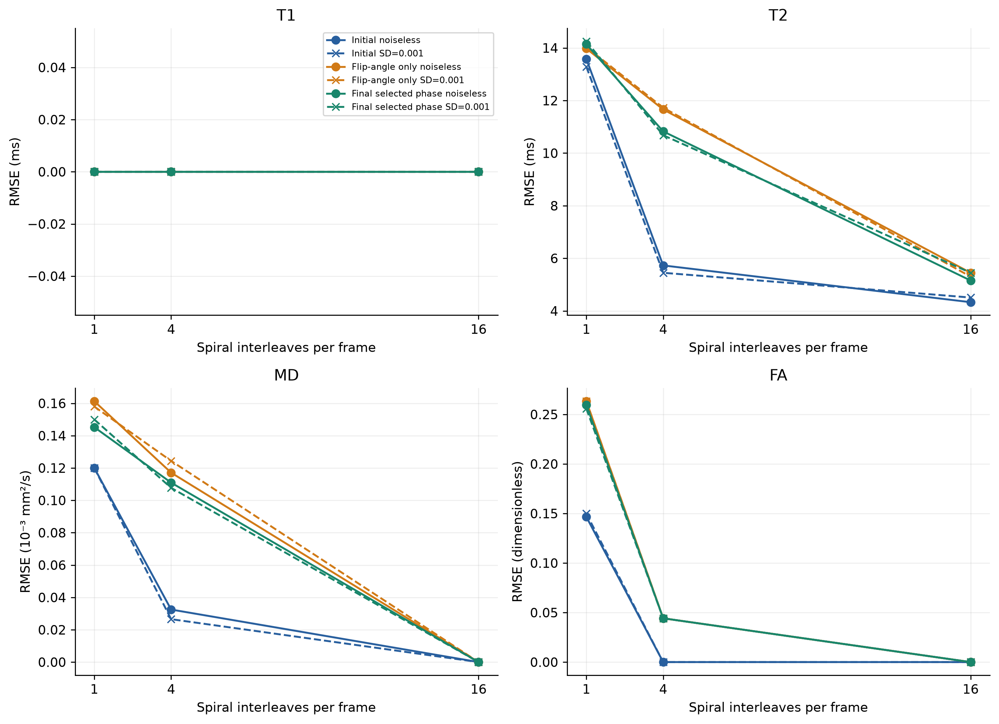

## 16. Discussion

spiral_L1_noise0: T1 tied, T2 worsened, MD worsened, FA worsened. spiral_L4_noise0: T1 tied, T2 worsened, MD worsened, FA worsened. spiral_L16_noise0: T1 tied, T2 worsened, MD tied, FA tied. spiral_L1_noise0.001: T1 tied, T2 worsened, MD worsened, FA worsened. spiral_L4_noise0.001: T1 tied, T2 worsened, MD worsened, FA worsened. spiral_L16_noise0.001: T1 tied, T2 worsened, MD tied, FA tied. The flip-only condition isolates the effect of adding the selected phase at fixed flip angles within this model. This does not establish a universal causal benefit of RF-phase optimization or transfer beyond the tested grid, tissues, sampling and reconstruction. A lower objective is not evidence of universally smaller map errors.

At fixed optimized flip angles, the following table isolates addition of the selected phase. Native units are ms, ms, mm²/s and dimensionless FA.

| Condition | Parameter | Flip-only RMSE | Final RMSE |
| --- | --- | --- | --- |
| spiral_L1_noise0 | T1 | 0 | 0 |
| spiral_L1_noise0 | T2 | 13.9754 | 14.1421 |
| spiral_L1_noise0 | MD | 0.000161294 | 0.000145237 |
| spiral_L1_noise0 | FA | 0.263317 | 0.259582 |
| spiral_L4_noise0 | T1 | 0 | 0 |
| spiral_L4_noise0 | T2 | 11.6592 | 10.8253 |
| spiral_L4_noise0 | MD | 0.000117094 | 0.000110926 |
| spiral_L4_noise0 | FA | 0.0441942 | 0.0441942 |
| spiral_L16_noise0 | T1 | 0 | 0 |
| spiral_L16_noise0 | T2 | 5.44862 | 5.15388 |
| spiral_L16_noise0 | MD | 0 | 0 |
| spiral_L16_noise0 | FA | 0 | 0 |
| spiral_L1_noise0.001 | T1 | 0 | 0 |
| spiral_L1_noise0.001 | T2 | 14.0312 | 14.2522 |
| spiral_L1_noise0.001 | MD | 0.00015799 | 0.00015 |
| spiral_L1_noise0.001 | FA | 0.263317 | 0.255792 |
| spiral_L4_noise0.001 | T1 | 0 | 0 |
| spiral_L4_noise0.001 | T2 | 11.726 | 10.68 |
| spiral_L4_noise0.001 | MD | 0.000124373 | 0.000107711 |
| spiral_L4_noise0.001 | FA | 0.0441942 | 0.0441942 |
| spiral_L16_noise0.001 | T1 | 0 | 0 |
| spiral_L16_noise0.001 | T2 | 5.3033 | 5.44862 |
| spiral_L16_noise0.001 | MD | 0 | 0 |
| spiral_L16_noise0.001 | FA | 0 | 0 |

## 17. Limitations

The model retains nine documented strict expected failures: B01, D01, D02, M01, M02, M03, G01, I01, I02. Valid tensor maps do not fix tensor EPG attenuation. Wavevectors are not scanner-calibrated. The dictionary is coarse, on-grid and restricted to prolate tensors and two axes. The diagnostic holds orientation fixed; parameter correlations and discrete matching differ from its local noise model. SLSQP is local; phase searches are finite and projection can suppress alternating structure or smear reset gaps. Golden spiral sampling lacks intra-readout decay, coils, off-resonance and measured scanner timing. DCF-weighted adjoint is not an inverse. The external Heesterbeek analytical UEE disagreement remains: acquisition agreement is not agreement of its error predictor or general diffusion validation. No external source code was copied here; existing independently reimplemented/conceptually inspired acquisition methodology and GPL provenance are documented in docs/undersampling_validation.md.

| Component | Status | Evidence / limitation |
| --- | --- | --- |
| Initial sequence | PASS | Actual decoded train meets constraints; baseline saved before optimization. |
| Flip-angle optimization | PASS | Optimization terminated successfully; local solution only. |
| Phase candidate generation | PASS | Existing generators/projection; identical angle coefficients verified. |
| Phase method comparison | PARTIAL | Predeclared objective and finite grid; no continuous/global family optimum claim. |
| Final phase optimization | PARTIAL | Selected-family local grid refinement only; no free-form or joint refinement. |
| EPG simulation | PARTIAL | Core tests pass; preserved G01 and tensor attenuation defects remain. |
| Diffusion tensor handling | PARTIAL | PSD construction passes; D01/D02 signal attenuation defects remain. |
| MD calculation | PASS | Physical trace(D)/3 used in phantom/fitting; legacy helper excluded. |
| FA calculation | PASS | Eigenvalue invariant agrees with requested prolate tensor FA. |
| CRLB evaluation | PARTIAL | Objective excludes MD/FA; physical-coordinate FD diagnostic is conditional on legacy physics. |
| Phantom generation | PASS | On-grid two-compartment parameter/tensor checks passed. |
| Reference reconstruction | PASS | All-atom, direct and noiseless Cartesian gates for all three sequences. |
| Spiral trajectory | PARTIAL | Coordinate tests/cross-validation pass; scanner timing and gradient calibration untested. |
| NUFFT acquisition | PASS | Validated operator reused; Cartesian complex-image gate passes. |
| Undersampled reconstruction | PARTIAL | Weighted adjoint is not an inverse; aliasing and gain bias remain. |
| T1 recovery | PARTIAL | Exact on-grid reference recovery; restricted grid, undersampling errors and no off-grid certification. |
| T2 recovery | PARTIAL | Exact on-grid reference recovery; restricted grid, undersampling errors and no off-grid certification. |
| MD recovery | PARTIAL | Exact on-grid reference recovery; restricted grid, undersampling errors and no off-grid certification. |
| FA recovery | PARTIAL | Exact on-grid reference recovery; restricted grid, undersampling errors and no off-grid certification. |
| End-to-end pipeline | PARTIAL | Workflow executed; computational consistency does not certify deficient diffusion physics. |

## 18. Conclusion

The worked example completes the requested computational chain with an objective reduction of 18.50%, under the established conditional objective. Reference recovery is validated for the tested on-grid phantom. Undersampling conclusions are parameter- and condition-specific as reported above. Overall scientific certification remains PARTIAL; this run does not resolve the known diffusion model defects.

